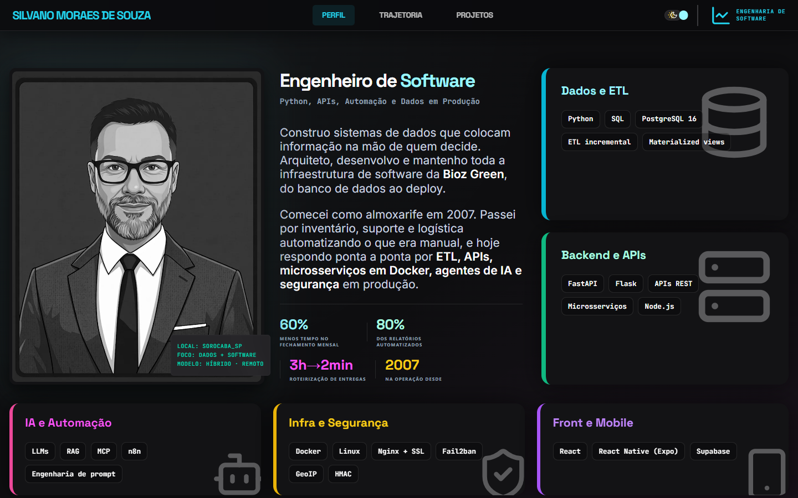
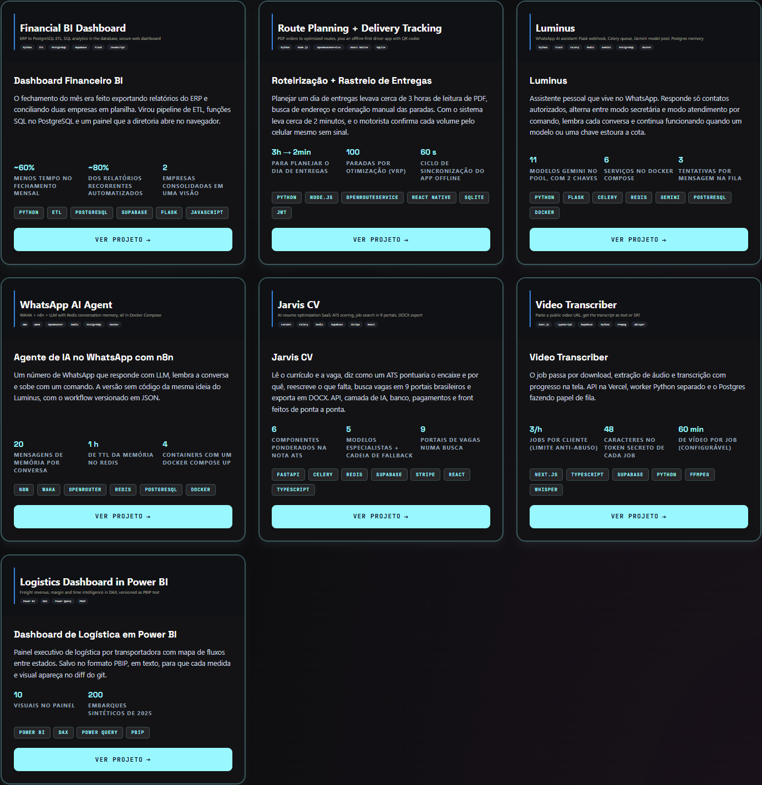

<p align="center">
  
</p>

# silvanomsouza.vercel.app

<p>
  <a href="https://silvanomsouza.vercel.app"></a>
  
  
  
</p>

Personal portfolio of Silvano Moraes de Souza, Software Engineer (Python, APIs, automation and data in production). The site is in Portuguese.



<details>
<summary>Projects page: every card mirrors a GitHub README</summary>



</details>

| Page | Content |
|---|---|
| `/` | Profile, headline and stack, same text as the LinkedIn About section |
| `/trajetoria` | Career timeline, same as LinkedIn Experience |
| `/projetos` | Open-source projects, with a real excerpt of production ETL code |
| `/projeto/:slug` | Problem, solution, highlights, engineering decisions and limitations of each project, mirroring its GitHub README |

Project data lives in [`src/data/portfolio.json`](src/data/portfolio.json). Banners in `public/banners/` are the same SVGs as `docs/banner.svg` in each repository.

```bash
npm install
npm run dev      # http://localhost:5173
npm run build
```
